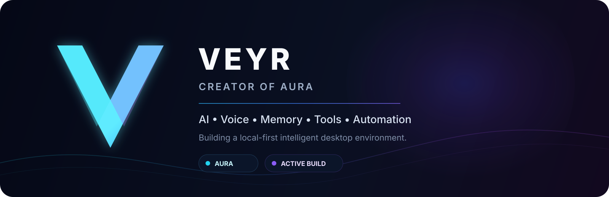
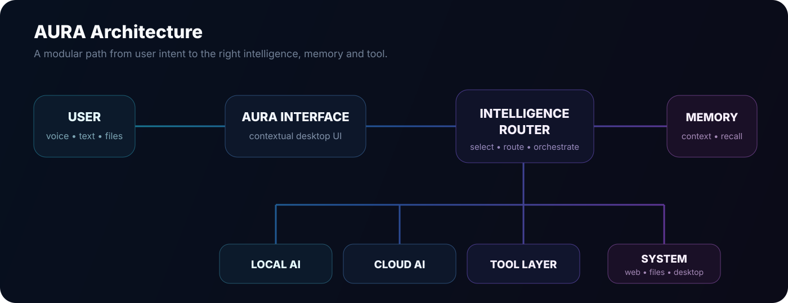

<div align="center">



<br>

[](#aura)
[](#aura)
[](https://github.com/VeyrNova)
[](https://youtube.com/@VeyrNova)

</div>

<br>

## About

I'm **Veyr**, an independent creator building **AURA** — a local-first AI desktop environment focused on natural interaction, contextual memory, intelligent tool routing and modular AI orchestration.

AURA is not designed as another chat window. The goal is a desktop assistant that can understand intent, keep useful context, select the right intelligence or tool, and act through one coherent interface.

<br>

<a id="aura"></a>

## AURA

<table>
<tr>
<td width="25%" align="center"><b>🧠 Intelligence</b><br><sub>Local + cloud model orchestration</sub></td>
<td width="25%" align="center"><b>🎙 Voice</b><br><sub>Natural speech input and output</sub></td>
<td width="25%" align="center"><b>💾 Memory</b><br><sub>Persistent contextual recall</sub></td>
<td width="25%" align="center"><b>🛠 Tools</b><br><sub>Files, web, system and automation</sub></td>
</tr>
</table>

> **One interface. Multiple intelligences. One assistant.**

<br>


<!-- AURA_PROFILE_STATUS_START -->
## Current AURA checkpoint

**23 September 2026** — AURA is currently in a stabilization and performance phase.

- Sanitized validation branch: `validation/aura-current-pre-performance-safe-20260923`
- Validated SHA: `61a4d4d5302846942921d05e457ab2a08590e365`
- Active Windows Chromium surface: `v0.7.2.2-rc4.2`
- Immediate work: dead/redundant-code audit → UI patch consolidation → startup/performance optimization
- Public-repository policy: no local databases, browser profiles, secrets, logs, private media or temporary runtime state

The next technical milestone is to reduce startup cost without removing features or changing validated behavior.
<!-- AURA_PROFILE_STATUS_END -->

<!-- AURA_PROFILE_R21_START -->
### Latest validated milestone — R21

On **23 September 2026**, AURA validated lazy loading for the global cartography dataset. The change removes **7.32 MB** from the initial blocking JavaScript path while preserving the Weather map and loading global cartography only when needed.

Current focus: startup optimization, dead-code verification and careful consolidation of accumulated UI patch layers.
<!-- AURA_PROFILE_R21_END -->

<!-- AURA_PROFILE_R23_START -->
### R23 runtime result

R23 was tested on **23 September 2026** and rejected after a UI regression affecting side panels and the Memory, Tasks, Agenda and Modules surfaces. The local rollback restored normal behavior.

**R21 remains the current validated performance checkpoint.**
<!-- AURA_PROFILE_R23_END -->

<!-- AURA_PROFILE_R25_START -->
### R25 CSS audit

R25 found no fully redundant stylesheet. The main consolidation candidate is `aura-dev-ui-screen-fit-r3-fix2.css`, where **85.56%** of declarations are reproduced exactly later in the cascade. A declaration-level audit is required before any cleanup.
<!-- AURA_PROFILE_R25_END -->

<!-- AURA_PROFILE_R27_START -->
### R27 runtime result

R27 was rejected after a runtime panel regression affecting Memory, Tasks, Agenda and Modules. The exact pre-R27 CSS was restored and normal behavior returned. R21 remains the validated performance baseline; optimization now shifts to runtime lifecycle profiling rather than static cascade trimming.
<!-- AURA_PROFILE_R27_END -->

## Current Focus

| Area | Status | Direction |
|---|:---:|---|
| AI orchestration | ● Active | Model and provider routing |
| Voice interaction | ● Active | Speech input, output and live routing |
| Contextual memory | ● Active | Relevant long-term project context |
| Adaptive interface | ● Active | Task-specific UI and reactive states |
| Desktop automation | ◐ Building | Reliable real-world actions |
| Developer Fabric | ◐ Building | Multi-agent development orchestration |
| Public Alpha | ○ Planned | Controlled external testing |

<br>

## Architecture



<br>

## Tech

<div align="center">


</div>

<div align="center">
<sub>AI orchestration • Local LLMs • Voice • Memory • Tool calling • Desktop apps • Automation • Developer agents</sub>
</div>

<br>

## AURA Developer Fabric

The **Developer Fabric** is AURA's development orchestration layer. Its purpose is to maintain a shared project context while routing development work toward the most suitable coding model, agent or tool.

```text
                         AURA
                           │
                    Developer Fabric
                           │
               ┌───────────┼───────────┐
               │           │           │
          Coding Agent  Coding Agent  Coding Agent
               │           │           │
               └───────────┼───────────┘
                           │
                    Shared Context
                           │
                    Project + Tools
```

<br>

## Principles

<table>
<tr>
<td width="50%">

### Local first
Privacy-sensitive and latency-sensitive workloads should be able to run locally whenever practical.

### Provider independent
Models and providers should remain replaceable rather than becoming hard dependencies.

</td>
<td width="50%">

### Context matters
The assistant should retain useful project context without treating every interaction as isolated.

### Tools over text
When a task needs an action, AURA should route to a capability instead of only generating an answer.

</td>
</tr>
</table>

<br>

## Roadmap

`Foundation` **→** `Intelligence` **→** `Memory` **→** `Voice` **→** `Tools` **→** `Automation` **→** `Developer Fabric` **→** `Alpha`

**Current stage:** active private development and reliability work.

<br>

## Public Development

The public side of AURA will focus on architecture, demonstrations, screenshots, technical notes and development milestones. Private runtime components, credentials and sensitive configuration remain outside public repositories.

<div align="center">

<br>

### Follow the build

[](https://github.com/VeyrNova)
[](https://youtube.com/@VeyrNova)

<br><br>

**VEYR × AURA**

<sub>Think. Route. Remember. Act.</sub>

</div>
